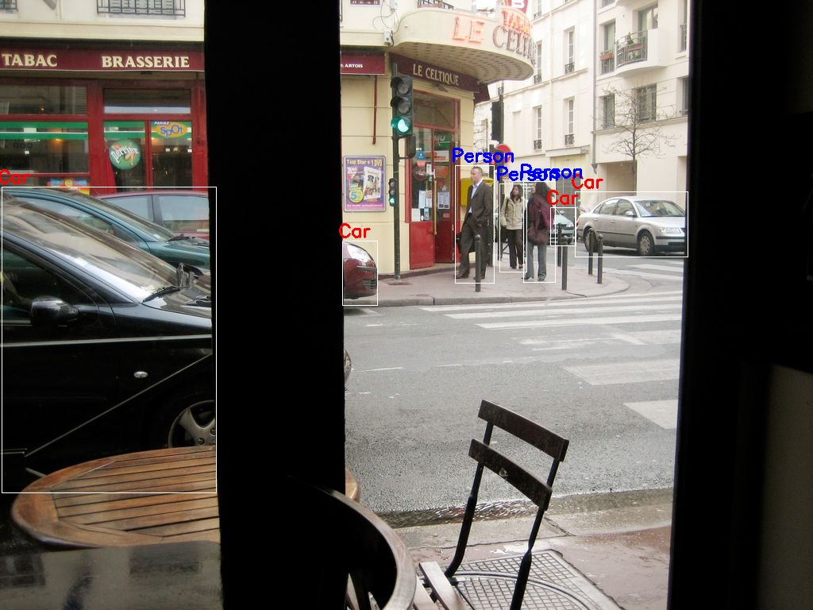

# FasterRCNN_Object_Detection

A framework to train FasterRCNN model for object detection.  
In this example, I have trained it on a dataset with cars and persons in COCO format.

### How to run
1. Clone the repo
2. Install requirements `pip install -r requirements.txt` (Might need to install torch and torchvision separately)
4. Change image directory and run test.py (or test_video.py)  
    - `python3 test.py`

### Results

### Possible Future Works
- [ ] Adding arguments for training
- [ ] Containerization
